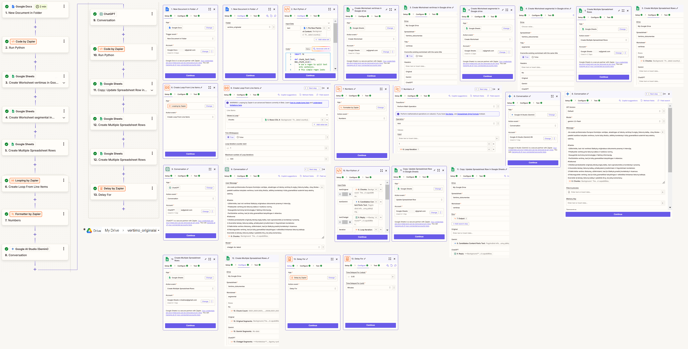

# LongDocProcessingWithLLMs: processing long documents with LLMs (ChatGpT, Gemini etc.) using Zapier.com automation platform

This guide shows how to set up a Zapier.com process, which takes an uploaded document in Google drive and processes a long docx document in chunks using Gemini and ChatGPT LLMs and saves the results in a Google spreadsheet.

This guide will walk you through creating a Zap (automated workflow) that mirrors the one in the scheme (see the image in the repository). 

This particular Zap shows an example of how to **translate** the document, but the same process can be used for extracting any information from the provided text or process it in any way, depending on the instructions that you provide to LLMs.

In the example, the Zap takes a new document in English and translates it to another language (e.g. Lithuanian). 

It starts the job when a new document is added to a Google Docs folder on a Google drive, chunks it to pieces using Python code, sends each piece to ChatGPT and Gemini, translates the document, and then saves the translated chunks to a Google spreadsheet.

## Step 1: Getting Started

-Create an account on Google (https://drive.google.com), perhaps make a separate account just for this process to avoid any personal data leaks. 
-Create a folder, e.g. "vertimo_originalai" ("originals of translations" in Lithuanian :-), in which we'll be dropping our new documents for processing, and a Google spreadsheet, e.g. "Vertimo_dokumentas" ("translated document"), in which we'll store the results. Create two worksheets there: "vertimas" ("translation" in Lithuanian) and "segmentai" ("segments" in Lithuanian)

-Create a Google AI Studio account, and create an "API key" that will act as a sort of your password. Click a button "Get API key".
-Create a https://platform.openai.com/ account, and create an "API key" on Dashboard/API keys.

-Create an account on Zapier.com (or log in if you already have one).
Click the "Create Zap" button.

## Step 2: Setting up the Trigger (When to start)

### 1. New Document in Folder (Trigger)

Choose App: 
Search for and select "Google Docs."
Trigger Event: 
Choose "New Document in Folder." This means the Zap will start whenever a new document is added to a folder.
Connect Account: 
Connect your Google Docs account to Zapier. You'll need to authorize Zapier to access your Google Docs.
Customize Folder: 
Select the specific folder in your Google Docs that you want Zapier to monitor for new documents, e.g. "vertimo_originalai"
Test Trigger: 
Zapier will test the connection to ensure it can see new documents in the folder.

## Step 3: Adding Actions (What to do)

### 2. Run Python (Action)

Choose App: 
Search for and select "Code by Zapier."
Action Event: 
Choose "Run Python."
Input Data: 
This is where you'll pass data from the Google Docs trigger to your Python script.
In the "Input Data" section, you'll want to include the "File" or "Document Content" from the Google Docs trigger. You can name these input fields (e.g., text).
Code: 
Paste this Python code into the provided code editor:

```
import re

def chunk_text(text, max_chunk_size):
    # Use a regex to split text into sentences.
    # This simple regex looks for a punctuation mark (. ! or ?) followed by whitespace.
    sentences = re.split(r'(?<=[.!?])\s+', text)
    chunks = []
    current_chunk = ""
    
    for sentence in sentences:
        # If adding this sentence would exceed the maximum chunk size...
        if len(current_chunk) + len(sentence) + 1 > max_chunk_size:
            # If we already have some text in the current chunk, save it.
            if current_chunk:
                chunks.append(current_chunk.strip())
                current_chunk = sentence
            else:
                # In case a single sentence is longer than max_chunk_size,
                # break the sentence into smaller parts.
                for i in range(0, len(sentence), max_chunk_size):
                    part = sentence[i:i+max_chunk_size].strip()
                    if part:
                        chunks.append(part)
                current_chunk = ""
        else:
            # Otherwise, append the sentence to the current chunk.
            if current_chunk:
                current_chunk += " " + sentence
            else:
                current_chunk = sentence

    # Append any remaining text.
    if current_chunk:
        chunks.append(current_chunk.strip())

    return chunks
# 'text' is expected to be passed as inputData from a previous step.
text = input_data.get("text", "")
# Process the text into chunks.
chunks = chunk_text(text, max_chunk_size=1500)
# Return the chunks
return {"chunks": chunks}

```

Your code receives the input data (e.g., text), chunks the content of the document into several chunks, based on the approximate number of characters that you indicate in the parameter "max_chunk_size=1500". Note that the splitting is not precise, and is done searching for ".","?","!" characters around the indicated character limit, to avoid splitting in the middle of the sentence.

The output is returned in the variable "chunks". It contains all of the extracted chunks.

Test Action: 
Zapier will run your Python code with sample data to ensure it works correctly.

### 3. and 4. "Create Worksheet" on our previously created Spreadsheet "Vertimo_dokumentas".

Choose App: Search for and select "Google Sheets."
Action Event: Choose "Create Worksheet" and add the headings of the new worksheets ("new", because they will be replaced every time an action is triggered":

-worksheet "vertimas"
Original
Gemini
ChatGPT

and

-worksheet "segmentai"
No
Original
Gemini
ChatGPT

Connect Account: Connect your Google Sheets account to Zapier.
Test Action: Zapier creates/overwrites the worksheets with the headings.

### 5. Create Multiple Spreadsheet Rows (Google Sheets Action)

This step involves taking data that's been processed or transformed with python and adding it as multiple rows to a Google Sheet.

Here's what you need to do:

Action Event:

The action event should be set to "Create Multiple Spreadsheet Rows." This tells Zapier you're adding more than one row at a time.
Connect Account:
If you haven't already connected your Google Sheets account in a previous step, you'll be prompted to do so. Click "Connect an Account" and authorize Zapier to access your Google Sheets.

Choose Spreadsheet: Select the Google Sheet where you want to add the rows. Click the dropdown menu and choose the spreadsheet. 
Choose Worksheet: Select the worksheet "vertimas" within the spreadsheet.
Important: Make sure this worksheet exists in your Google Sheet. If it doesn't, create it in Google Sheets before proceeding. 

Rows: This is where you tell Zapier which pieces of data go into which columns of your spreadsheet.
This field is crucial for handling multiple rows.
Set "Chunks" variable from the Python action to go to the worksheet "Original".

### 6. Create Loop From Line Items (Looping by Zapier)

This step is all about repeating a set of actions for each item in a list. Imagine you have a list of products, and you want to do the same thing for each product (like adding it to an inventory). Looping lets you automate that repetition.

Here's how it works:

Choose App:

Zapier should automatically have "Looping by Zapier" selected. If not, search for and select "Looping by Zapier."
Action Event:

The action event should be "Create Loop From Line Items." This tells Zapier you're creating a loop to process a list of items (chunks of text in our case).
Input - Values to Loop:

This is the most crucial part. You need to tell Zapier what list to loop through.
Set the name of the Values to Loop to "Chunks" and then chose a field "Rows COL A" from the spreadsheet "vertimas".

This is a bit cryptic, but here's what it likely means:
Chunks: This refers to the data being passed from a previous action ("Create Multiple Spreadsheet Rows"). It's being passed in "chunks" or batches.

In essence: This part defines what list of items the loop will process. In this case, it's taking data from specific columns of the rows created in the previous step.

Trim Whitespace: This checkbox allows you to remove any extra spaces before or after the data in each item. It's a useful cleanup step.
Test Action: Click "Continue" to test the loop. Zapier will run through a sample loop to make sure it's working as expected. Review the test results.

### 7. Create Formatter by Zapier action for Numbers.

This step is about doing math with your data.  It lets you add, subtract, multiply, divide, and perform other calculations on numbers you've gathered from previous steps. 

In our example, we need to add "1" to the iteration number. If our iteration is 1, we need a variable that would show "2", for iteration No. 2, we'll need a variable 3 etc., because we'll have to indicate the process, in which worksheet rows we have to include responses from LLMs.

Here's how to set it up:

Choose App:
Zapier should automatically have "Formatter by Zapier" selected. If not, search for and select it.
Transform:

Under the "Transform" dropdown, choose "Numbers." This tells Zapier you're working with numerical data.
Operation:

Select the mathematical operation you want to perform. Choose "Add". 
Values - Input:

This is where you input the numbers you want to calculate.
Important: You can either type in numbers directly or use data from previous steps. Click the "+" button to choose data from earlier steps.
Choose "1" and "Loop Iteration" variable from the previous step. This means:
"1": The number 1 is being added directly.
"Loop Iteration": The current loop number (from action 6) is being added. So, in the first loop, it will add 1 + 1; in the second loop, it will add 1 + 2; and so on.
Test Action:
Click "Continue" to test the calculation. Zapier will run the calculation with the provided numbers and show you the result.

### 8. Create action Google AI Studio - Gemini

This step uses the power of Gemini, Google's advanced AI, to have a conversation. It's likely being used to translate text or perform some other natural language processing task.

Here's how to set it up:

Zapier should automatically have "Google AI Studio (Gemini)" selected. If not, search for and select it.
Action Event:
The action event should be "Conversation." This indicates you're using Gemini to conduct a conversation.
Connect Account:
If you haven't already connected your Google AI Studio account, you'll be prompted to do so. Click "Connect an Account" and authorize Zapier to access it. Indicate the API key you've created.

Configure Gemini:

API Version: Leave this at "Default" unless you have a specific reason to change it.
Model: Select the Gemini model you want to use. "gemini-2.0-flash" is chosen in the example. Different models have different strengths and capabilities.
Message: This is where you provide the input for Gemini.

As an example use this prompt:
```
Jūs esate profesionalus Europos Komisijos vertėjas, atsakingas už tekstų vertimą iš anglų į lietuvių kalbą. Jūsų tikslas – pateikti aukštos kokybės vertimus, kurie būtų tikslūs, atitiktų kontekstą ir būtų gramatiškai suderinti tarp atskirų sakinių.

#Gairės
-Užtikrinkite, kad visi vertimai išlaikytų originalaus dokumento prasmę ir intenciją.
-Pritaikykite vertimą prie lietuvių kalbos ir kultūros normų.
-Išsaugokite techninę terminologiją ir faktinę informaciją.
-Peržiūrėkite vertimą, kad jis būtų gramatiškai taisyklingas ir sklandus.
#Veiksmai
1.Atidžiai perskaitykite originalų tekstą anglų kalba, kad suprastumėte jo kontekstą ir prasmę.
2.Išverskite tekstą į lietuvių kalbą, pritaikydami jį kultūriniam ir lingvistiniam kontekstui.
3.Patikrinkite vertimo tikslumą, užtikrindami, kad jis išlaikytų pradinį kontekstą ir niuansus.
4.Pakoreguokite vertimą, kad jis būtų gramatiškai taisyklingas ir stilistiškai tinkamas lietuvių kalboje.
Išverskite šį tekstą į lietuvių kalbą ir pateikite tik jį, be jokių komentarų:
{{Chunks}}
```

It translates to: "You are a professional translator for the European Commission, responsible for translating texts from English into Lithuanian. Your goal is to provide high-quality translations that are accurate, contextual, and grammatically consistent between sentences. <...> Translate this to Lithuanian:"

Replace this with your own instructions or the text you want Gemini to process. You can use data from previous steps by clicking the "+" button and selecting the appropriate fields. In our example, use the "Chunks" variable from the "Loop" action above. 

Test Action:
Click "Continue" to test the action. Zapier will send your message to Gemini and check if it's working correctly. Review the test results and the output generated by Gemini.

This step is like having a conversation with a highly intelligent AI. You provide the input (your message and guidelines), and Gemini processes it based on your instructions. The output can then be used in subsequent steps of your Zap, such as saving the translated text to a Google Sheet or sending it in an email.

This step allows you to leverage the power of AI for tasks like translation, summarization, content generation, and more. Experiment with different prompts and models to see what Gemini can do!

### 9. Create the ChatGPT conversation in the same way as in the previous step. 

Use "chatgpt-4o-latest" model. For Assistant instructions you can say something like: "you are a professional EU translator."
Set "max tokens" to 4096.

### 10. Create Run Python action

This step uses Python code to process the output from the Gemini and ChatGPT conversations in the previous steps.  It allows for complex manipulation and transformation of information. In the example it cuts the bigger chunks of text to sentences for our convenience (in case of translation task!), i.e. aligns the English sentences to Lithuanian sentences.

Here's how to configure it:

Choose App:

Zapier should automatically have "Code by Zapier" selected. If not, search for and select it.
Action Event:

The action event should be "Run Python."
Input Data:

This is where you feed data into your Python script. You'll see several fields:
textOriginal: This contains the original text that was sent to Gemini for translation or processing.
textGemini: This field holds the output from the Gemini conversation.
textChatgpt: This field contains the output from the ChatGPT conversation.
Iteration: This represents the current loop iteration (i.e. numbers: 1, 2, 3, 4, ... etc.), because this Python code is within a loop, as the original text is processed chunk after chunk.

Mapping Data: Click the "+" button next to each field to select the data you want to pass to your Python script. Make sure you're pulling from the correct steps and fields.

Code:
This is where you write your Python code. Include everything, starting from "import re...".
 
```
import re
"""
Explanation:
-------------
Because Python's 're' module does NOT allow variable-length patterns in a lookbehind, our previous approach using:

    (?<!\b(?:<variable-length patterns>))

causes "look-behind requires fixed-width pattern" errors.

Solution:
-------------
We avoid negative lookbehinds with variable-length patterns by:
1) Replacing all "non-splitting" exceptions (abbreviations, year notations, domains, decimals, etc.) with placeholder tokens that do not contain sentence punctuation.
2) Splitting on the normal sentence boundary pattern:
      (?<=[.!?])\s+ | \n
3) Replacing the placeholder tokens back to their original text.

This ensures we never incorrectly split inside exceptions that contain dots.
"""

# Step 1: Define sets/patterns for exceptions that should NOT trigger sentence splitting.

# Common abbreviations in English and Lithuanian.
COMMON_ABBREVIATIONS = {
    "Mr.", "Mrs.", "Dr.", "i.e.", "e.g.", "vs.", "Prof.", "Jr.", "Sr.", "Inc.", "Ltd.", "Co.",
    "U.S.", "U.K.", "Ph.D.", "M.D.", "B.A.", "M.A.", "D.C.", "a.m.", "p.m.", "No.", "vol.", "pp.", "Ch.",
    "pvz.", "p.", "įsk.", "op.cit.", "ibid.", "plg.", "red.", "t.t.", "t.y.", "t. y.", "t. t.", "etc.", "tūkst.", "mln.", "mlrd.", "mlr.",
    "val.", "sav.", " d.", "mėn.", "proc."
}

# General regex patterns that might contain a dot but do not indicate end of sentence.
GENERAL_PATTERNS = [
    # Lithuanian year notation: "2025 m.", "1979 m." etc.
    r"\b\d{4}\sm\.",
    # Multiple uppercase initials: "J.R.R.", etc.
    r"\b[A-Z](?:\.[A-Z])+\.",
    # Single uppercase initial: "A.", "P.", etc.
    r"\b[A-Z]\.(?=\s[A-Z])",
    # Domain or file extension: "example.com", "file.pdf", etc.
    # Very simplified pattern.
    r"\b[A-Za-z0-9_-]+\.(?:com|lt|org|net|pdf|docx|xlsx|txt)\b",
    # Decimal/time patterns: "3.14", "14.45" etc.
    r"\b\d+\.\d+\b",
    # Enumerations: "1.", "10." etc.
    r"\b\d+\.",
]


def _build_exceptions_pattern():
    # Combine literal abbreviations + general patterns into a single pattern.

    # 1) Escape literal abbreviations so their dots don't become special in regex.
    escaped_abbrevs = [re.escape(abbr) for abbr in COMMON_ABBREVIATIONS]

    # 2) Combine into one alternation: (?:...|...)
    # Note: general patterns are already raw regex, so we just keep them.
    combined = escaped_abbrevs + GENERAL_PATTERNS

    # Single giant alternation pattern.
    # We use capturing groups so re.sub can pick the match text.
    return re.compile("(" + "|".join(combined) + ")")


EXCEPTIONS_PATTERN = _build_exceptions_pattern()


def chunk_text_by_sentences(text: str):
    """
    Splits text into individual sentences by splitting on:
        (?<=[.!?])\s+ or newlines (\n)
    But first, replaces certain known exceptions (which contain dots but do not end sentences) with placeholders.
    Then reverts the placeholders after splitting.
    """

    # Step 2: Replace exceptions with placeholders.
    placeholder_map = {}
    placeholder_counter = 0

    def replace_exceptions(m: re.Match):
        nonlocal placeholder_counter
        original = m.group(1)  # matched text
        placeholder = f"__PLACEHOLDER_{placeholder_counter}__"
        placeholder_map[placeholder] = original
        placeholder_counter += 1
        return placeholder

    # Protect exceptions by substituting them with placeholders.
    protected_text = EXCEPTIONS_PATTERN.sub(replace_exceptions, text)

    # Step 3: Split on sentence boundaries.
    # We no longer need a negative lookbehind. We do a simple split on punctuation + whitespace or newlines.
    split_pattern = re.compile(r"(?<=[.!?])\s+|\n")
    raw_sentences = re.split(split_pattern, protected_text)

    # Step 4: Revert placeholders in each piece.
    chunks = []
    for sentence in raw_sentences:
        for placeholder, original in placeholder_map.items():
            sentence = sentence.replace(placeholder, original)
        clean = sentence.strip()
        if clean:
            chunks.append(clean)

    return chunks
iteration = input_data.get("iteration","")
# 'text' is expected to be passed as inputData from a previous step.
textOriginal = input_data.get("textOriginal", "")
textGemini = input_data.get("textGemini", "")
textChatgpt = input_data.get("textChatgpt", "")
# Process the text into single-sentence chunks.
chunksOriginal = chunk_text_by_sentences(textOriginal)
chunksChatgpt = chunk_text_by_sentences(textChatgpt)
chunksGemini = chunk_text_by_sentences(textGemini)
maxlength = max(len(chunksOriginal), len(chunksChatgpt), len(chunksGemini))+1
maxlengths = [str(iteration).zfill(4)+"_"+str(i).zfill(4) for i in range(1,maxlength)]
# Return the chunks
return {"originalSegments": chunksOriginal, "chatgptSegments": chunksChatgpt, "geminiSegments": chunksGemini, "chunkCount": maxlengths}
```
Test Action:

Click "Continue" to test your Python code. Zapier will run the code with sample data to ensure it works correctly. Examine the output to verify it's chunking the text to sentences.

### 11. Create Google Sheets Action "Update Spreadsheet Row in Google Sheets"

This step takes the output from the LLMs and uses it to update a row in a Google Sheet for each chunk that is processed.

Here's how to configure it:

Choose App:

Zapier should automatically have "Google Sheets" selected. If not, search for and select it.
Action Event:

The action event is "Update Spreadsheet Row." This means you're modifying an existing row, not creating a new one.
Connect Account:

If you haven't already connected your Google Sheets account, you'll be asked to. Click "Connect an Account" and authorize Zapier to access your Google Sheets.
Customize Spreadsheet:

Choose Spreadsheet: Select the Google Sheet you want to update. In the example, "Vertimo_dokumentas".
Choose Worksheet: Select the worksheet "vertimas" within that spreadsheet. 
Find or Create Row:

This is a crucial step for "Update Spreadsheet Row." You need to tell Zapier which row to update. Use the variable we created with the Formatter in action 7 ("Output").

Map Data to Columns:

This is where you specify which data goes into which column of the row you're updating.

Gemini, ChatGPT: These fields refer to the outputs of the Gemini and ChatGPT steps. You can map these outputs to specific columns in your sheet. Choose "Candidates Content Parts Text" for Gemini, and for "Reply" for ChatGPT.
Original: This field refers to the original text that was processed and is already in the worksheet. Leave it blank, as we don't need to update this heading.

Test Action:
Click "Continue" to test the action. Zapier will attempt to find the row and update it with the provided data. Review the test results and check your spreadsheet to confirm the update was successful.

### 12. Create Google Sheets Action "Create Multiple Spreadsheet Rows"

This action is very similar to action 5. It takes text segments (original, Gemini translation, ChatGPT translation) from the previous Python action, and adds them as multiple rows to a Google Sheet.

Here's how to set it up:

Choose App:

Zapier should automatically have "Google Sheets" selected. If not, search for and select "Google Sheets."
Action Event:

The action event should be "Create Multiple Spreadsheet Rows."
Connect Account:

If you haven't already connected your Google Sheets account, you'll be prompted to. Click "Connect an Account" and authorize Zapier to access your Google Sheets.
Customize Spreadsheet:

Choose Spreadsheet: Select the Google Sheet where you want to add the rows ("Vertimo dokumentas" in the example).
Choose Worksheet: Select the specific worksheet within the spreadsheet ("segmentai"). Important: Ensure this worksheet exists in your Google Sheet. If it doesn't, create it in Google Sheets before proceeding.
Map Data to Columns:
This is where you tell Zapier which pieces of data go into which columns.

Rows: This field is crucial for handling multiple rows. You'll have to indicate four variables from action No. 10 (Python code):

-No: "Chunk Count" variable: This field is related to the loop count from Step 10. It is used to track and identify the rows being added. This code will allow us to sort the rows in the spreadsheet in correct order, because the chunks are not necessarily processed in sequence(!). A later chunk can be inserted in the spreadsheet earlier than the previous chunk.
-Original: "Original Segments" from Python action No. 10.
-Gemini: "Gemini Segments" from Python action No. 10.
-ChatGPT: "Chatgpt Segments" from Python action No. 10.

Test Action: Once you've mapped the data, click "Continue" to test. Zapier will add the rows to your sheet.

### 13. Create Delay by Zapier action "Delay For"

This action is designed to simply wait before the Zap continues with the next iteration (i.e. processing the next chunk of the text in the loop). This can be useful if we do not want to flood Gemini and ChatGPT APIs with very frequent requests (several requests in a few seconds).

Here's how to set it up:

Choose App "Delay by Zapier."
Action Event: "Delay For."
Set Delay:
Time Delayed For (value): Enter the numerical value for the delay, e.g. "0.05".
Time Delayed For (unit): Select the unit of time for the delay. Choose "Minutes".
Test Action:
Click "Continue" to test the action. Zapier will immediately proceed to the next step since it's just a delay instruction and doesn't require any external service interaction.

## Step 4: Turn on Your Zap

Once you've tested all the steps, set the slider "Tur Zap On" and click the "Publish" button. Your Zap is now active!

Python Code: The most critical part is the Python code. Make sure it's accurate and handles the document content as expected.
Data Mapping: Pay close attention to mapping the data in different steps. This ensures the correct information goes into the correct columns of your spreadsheets.
Testing: Test each step thoroughly to catch any errors early on.
Troubleshooting

Zapier Help: Zapier has excellent documentation and help resources. Use the search bar if you get stuck.
Code Errors: If your Python code isn't working, double-check the syntax and logic. Print statements can help you debug.
Connection Issues: Make sure you're connected to the correct accounts for Google Docs and Google Sheets.

